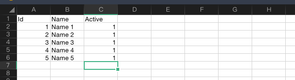

# laravel_import_csv
 
[source](https://medium.com/technology-hits/how-to-import-a-csv-excel-file-in-laravel-d50f93b98aa4)

- Clone this repo
- Make Database `laravel_import_csv`
- Import data from `laravel_import_csv.sql`
- Setting `.env`
- Run `composer install` in terminal
- Run `php artisan serve` in terminal
- Convert file `datasv2.xlsx` to `datav2.csv`



- You can convert it in [here](https://cloudconvert.com/xlsx-to-csv)
- Test In Postman


- Result


- For UI
```
http://localhost:8000/upload
```

---

```
Copyright 2022 M. Fadli Zein
```